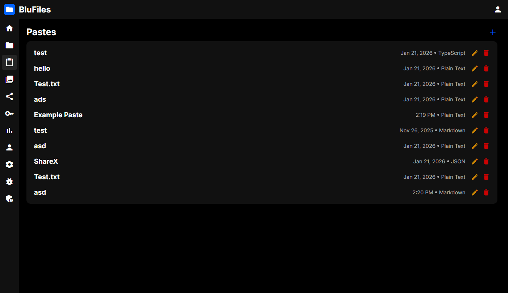
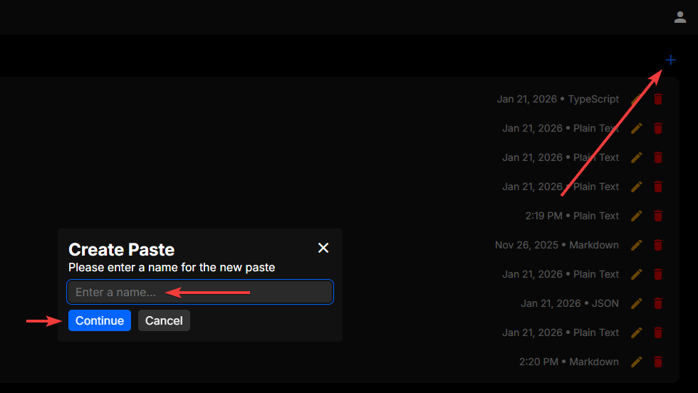
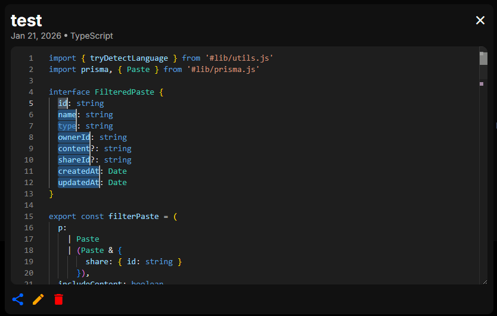
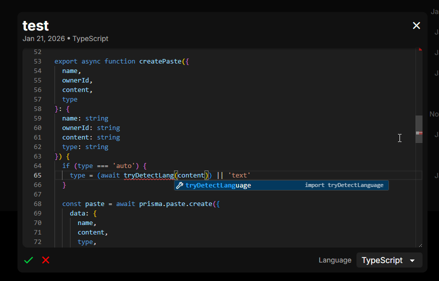
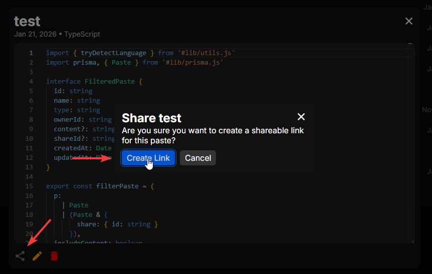
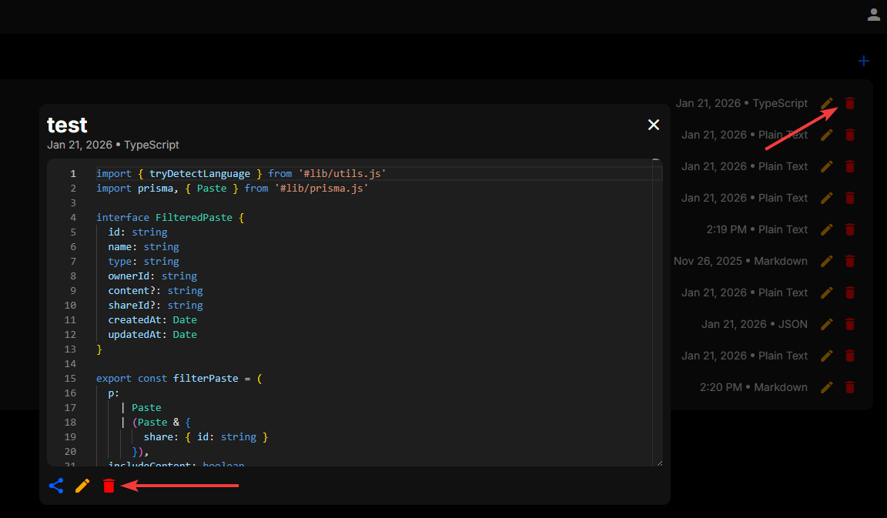

# Pastes

In the "Pastes" section, you can create, edit and delete pastes. These can be snippets of code in many different languages, or just plain text. A familiar language highlighted code editor is available for editing and viewing content.

## Interface

The main interface shows a list of your pastes:

## Creating Pastes

To create a paste, click the "+" icon in the top right of the page. You will be prompted to enter a name for the paste, and then you can simply start writing.

## Viewing and Editing Pastes

To open a paste, simply click on the paste in the list. This will pop up the paste viewer, where you can scroll around and copy text, or click the pencil in the lower left to edit the paste. While editing, you can also choose to automatically detect the language, or manually choose it from the list.

The Monaco editor is used for editing and viewing pastes, which is the same editor as in Visual Studio Code, so if you have used that before, editing pastes should feel very familiar.

After you are finished editing, you can click the checkmark in the lower left, or press Ctrl+S to save your changes.

## Sharing Pastes

Sharing a paste is easy, just click the share icon in the lower left of the paste viewer. Here you can choose to create and copy a link, or delete an existing shared link.

## Deleting Pastes

Pastes can be deleted either from the paste viewer, or from the paste list. In the paste viewer, click the trash icon in the lower left to delete the paste. From the paste list, click the trash icon on the right side of the paste you want to delete. You will be prompted to confirm the deletion, and once you confirm, the paste will be deleted permanently.
