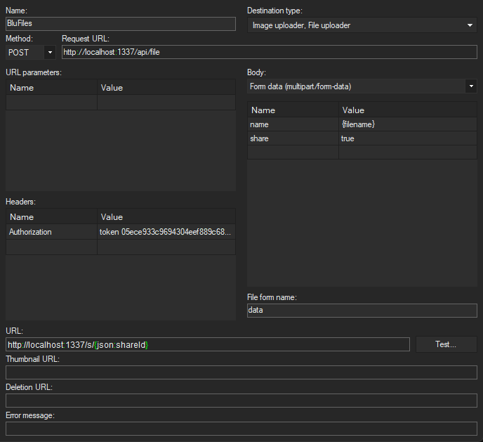

# Uploading files using the API

This guide will show you an example on how to upload files using the BluFiles API.

## Prerequisites

Before you can upload files using the API, you need to have an API token included in your `Authorization` request header. See [Setting up and using an API token](/guide/api-tokens) for more information on how to generate a token.

## Uploading a file as a multipart request

To upload a file, you can use the following endpoint: <OAOperationLink href="/api/post-file.html" method="post" title="Upload file" />

This endpoint accepts a `Content-Type: multipart/form-data` request with the following parameters:

- `name`: The name of the file. This is required.
- `folderId`: The ID of the folder to upload the file to. This is optional, and if not provided, the file will be uploaded to the root folder.
- `share`: Whether to share the file after uploading. The share link ID will be added to the response as the property `shareId`. This is optional, and defaults to `false`.
- `data`: The file to upload. This is required.

Here is an example response from the API after uploading a file:

```json
{
  "id": "cmmm4l5900001356nk5k9bwjv",
  "name": "Test.png", // file name
  "mime": "image/png", // detected MIME type
  "size": "25611", // file size in bytes
  "ownerId": "cmmm4l7710002356nhts4emo0",
  "folderId": null, // folder ID if the file is uploaded to a folder, null if uploaded to root
  "createdAt": "2026-03-11T14:16:25.966Z",
  "updatedAt": "2026-03-11T14:16:25.966Z",
  "shareId": "cmmm4ladt0003356nf1aeafi2" // share link ID if the file is shared, null if not shared
}
```

If `share` is set to `true`, a share will be created for the file, and the `shareId` property will be included in the response. To construct the share link URL, you can use the following format:

```http
https://files.bludood.com/s/<shareId>
```

In the example response above, the share link URL would be `https://files.bludood.com/s/cmmm4ladt0003356nf1aeafi2`.

### Example using ShareX



You can set up BluFiles as a custom uploader in ShareX to easily upload files using the API. To do this, you can use the following configuration:

```json
{
  "Version": "18.0.1",
  "Name": "BluFiles",
  "DestinationType": "ImageUploader, FileUploader",
  "RequestMethod": "POST",
  "RequestURL": "http://files.bludood.com/api/file",
  "Headers": {
    "Authorization": "token <generated API token>"
  },
  "Body": "MultipartFormData",
  "Arguments": {
    "name": "{filename}",
    "share": "true"
  },
  "FileFormName": "data",
  "URL": "http://files.bludood.com/s/{json:shareId}"
}
```

Make sure to replace `<generated API token>` with your actual API token, and `http://files.bludood.com` with the URL of your BluFiles instance.

Now you can configure ShareX to use this custom uploader:

- Select your custom uploader as the Destination -> Image/File uploader
- Enable "Upload image to host" in "After capture tasks"
- Enable "Copy URL to Clipboard" in "After upload tasks"

With this configuration, you can easily upload screenshots and other files using ShareX, and the share link will be automatically copied to your clipboard after uploading.
