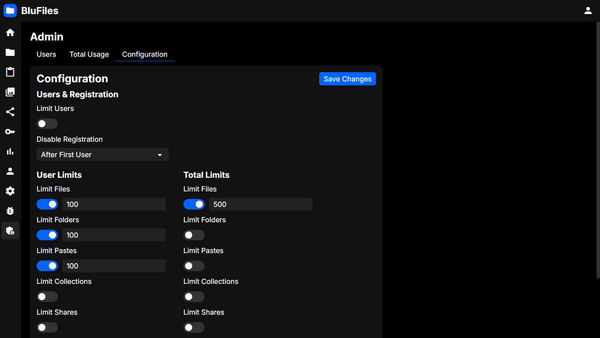

# Configuration

Here you can configure some settings for your BluFiles server, such as user registration and usage limits.

## Users & Registration

### Limit Users

You can enable this option to limit the number of users that can register or be created manually on your server

### Disable Registration

Here you can choose how user registration is handled:

- **No**: Anyone can register an account on your server.
- **Yes**: User registration is completely disabled. You will have to create user accounts manually from the "Users" page.
- **After First User**: This is the default behavior, and will disable registration after the first user is created.

## Limits

In this section you can set limits per user, and in total for the server. These limits can be disabled to allow free usage.

Limits per user will show up for everyone on the "Usage" page, while total limits will show up on the "Total Usage" admin page.

### File Limit (user, total)

Maximum amount of files, regardless of folder structure.

### Folder Limit (user, total)

Maximum amount of folders, regardless of structure.

### Paste Limit (user, total)

Maximum amount of pastes.

### Collection Limit (user, total)

Maximum amount of collections.

### Share limit (user, total)

Maximum amount of shared links.

### Token Limit (user)

Maximum amount of API tokens generated per user.

### Storage Limit in MB (user, total)

Maximum total storage used by a user or on the server. This is calculated by adding up the sizes of all files owned by the user or on the server. Setting a storage limit is especially useful if you have limited storage space on your server.
