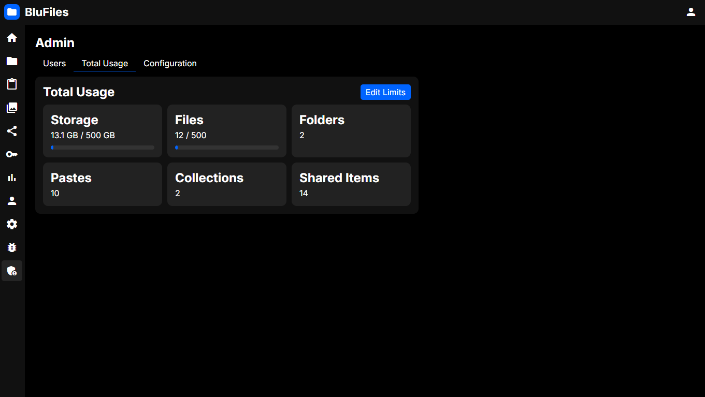

# Total Usage

Similar to the "Usage" page, this page shows the total usage of all users on the server for storage, files, pastes, etc.

If you have set total usage limits in the configuration, this will also show the limits and usage. Setting a storage limit is especially useful if you have limited storage space on your server. This can be configured on the ["Configuration" page](../config/index.md).
