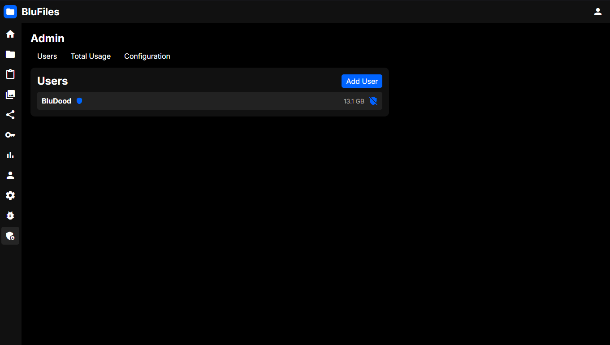
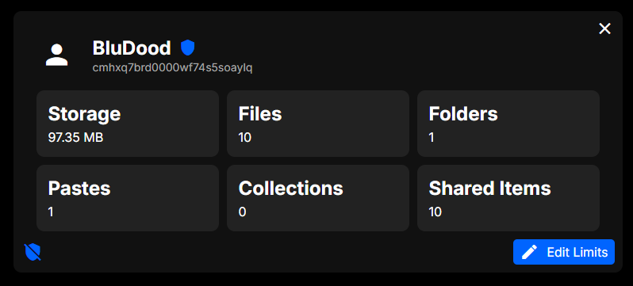
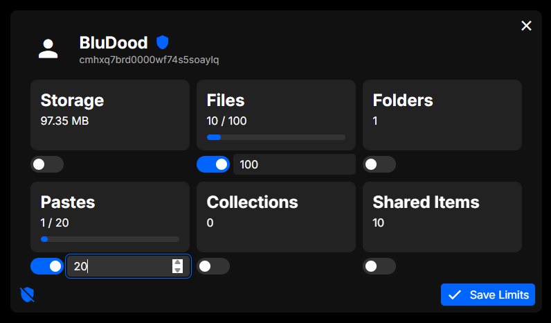
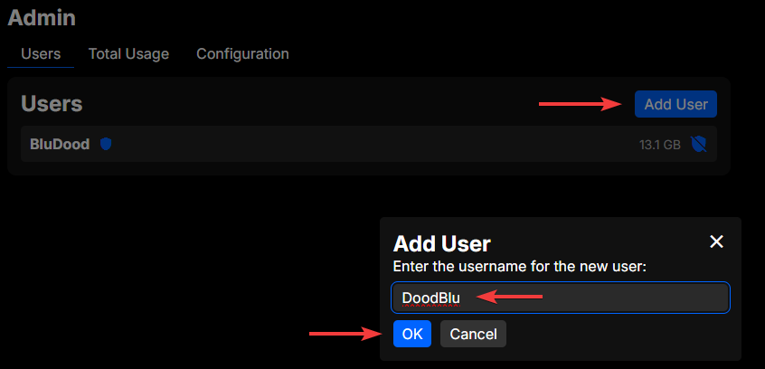
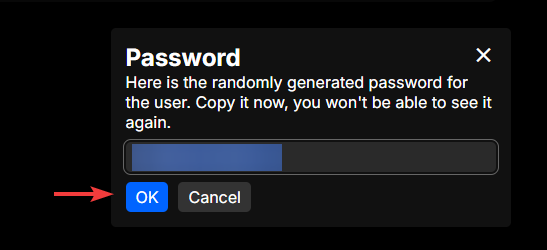
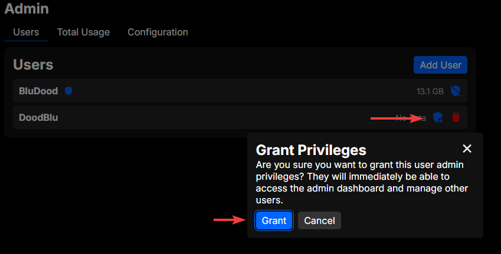
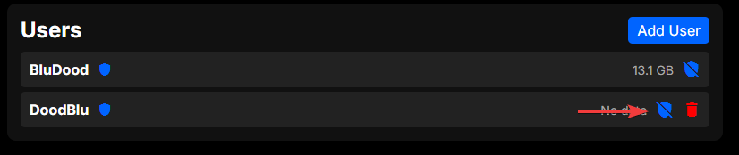
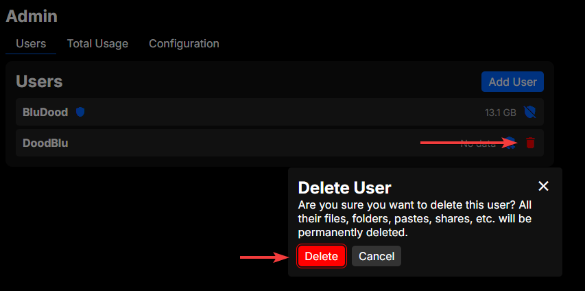

# User

In the "Users" section of the administration page, you can create and manage user accounts on your BluFiles instance.

## Interface

The main interface shows a list of registered users:

Administrators will have a shield symbol next to them. You will also see storage usage for each user.

## User Details View

Clicking a user in the list will open a popup with details about the user:

Here you can see stats about a user's usage, and also set specific usage limits for the user by clicking "Edit Limits". These limits will override the default user limits set in [Configuration](../config/index.md#limits).

You also have the same controls for deleting users and adjusting their admin access, as you have in the user list.

## Creating Users

To create a new user, click the "+" icon in the top right of the page. You will be prompted to enter a username for the new user, and a random password will be generated for them. You can copy the password and share it with the user, as they will need it to log in.

## Granting Administrator Privileges

To make a user an administrator, click the shield icon on the right side of the user you want to grant privileges to. You will be prompted to confirm the action, and once you confirm, the user will have administrator privileges.

> [!WARNING]
> The user will immediately have access to the administration panel and all its features, including managing settings and other users. Make sure to only grant administrator privileges to trusted users.

This can be revoked by clicking the shield icon again.

## Deleting Users

To delete a user, click the trash icon on the right side of the user you want to delete. You will be prompted to confirm the deletion, and once you confirm, the user will be deleted along with all of their files, pastes, and collections.

You cannot delete your own user account from here, that is done from the "Settings" page.
