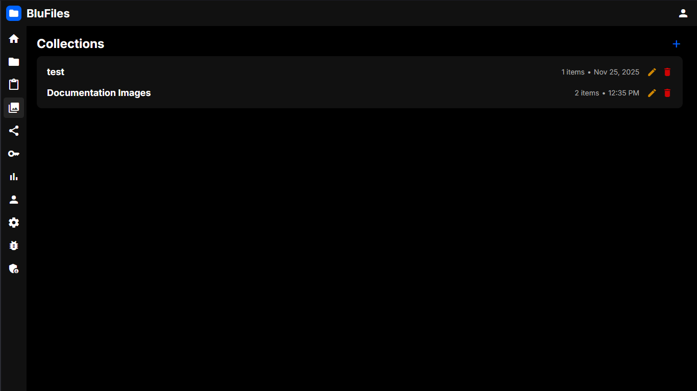
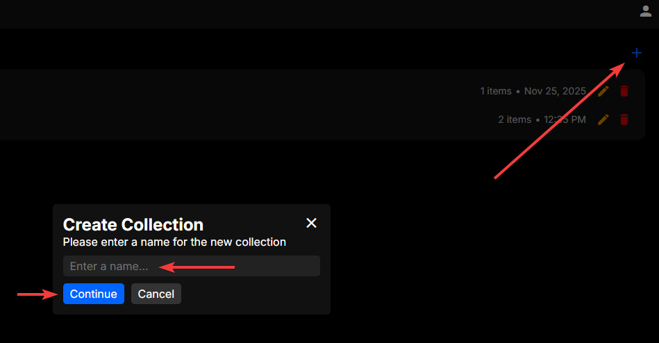
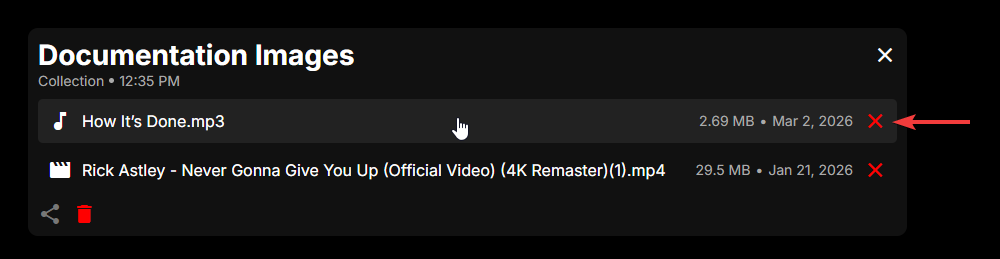
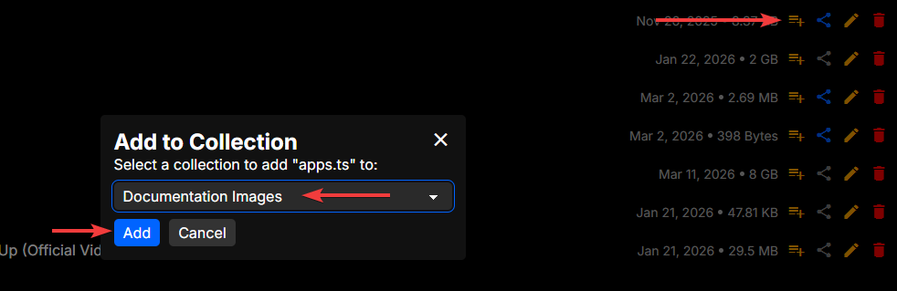
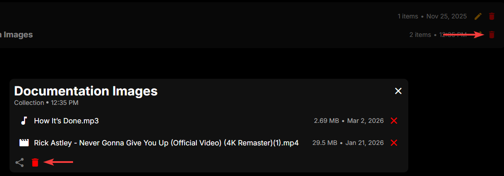

# Collections

In the "Collections" section, you can create, view, edit and delete collection. Collections are a way of sharing a set of files without giving access to an entire folder. They are ideal for sharing a group of related files, such as a group of images or documents.

## Interface

The main interface shows a list of your collections:

## Creating Collections

To create a collection, click the "+" icon in the top right of the page. You will be prompted to enter a name for the collection, then click "Create".

## Viewing Collections

To view a collection, simply click on the collection in the list. This will pop up the collection viewer with a list of all the files in the collection. Here you can click on a file to view it, and click the X icon to remove it from the collection.

## Sharing Collections

See [Sharing Items](../../features/sharing/index.md#sharing-items) for more information.

## Adding Files to Collections

To add a file to a collection, go to the file viewer and press the + icon on the right side of the file you want to add. Here you can choose which collection you want to add the file to.

## Deleting Collections

Collections can be deleted either from the collection viewer, or from the collection list. In the collection viewer, click the trash icon in the lower left to delete the collection. From the collection list, click the trash icon on the right side of the collection you want to delete. You will be prompted to confirm the deletion, and once you confirm, the collection will be deleted permanently.
