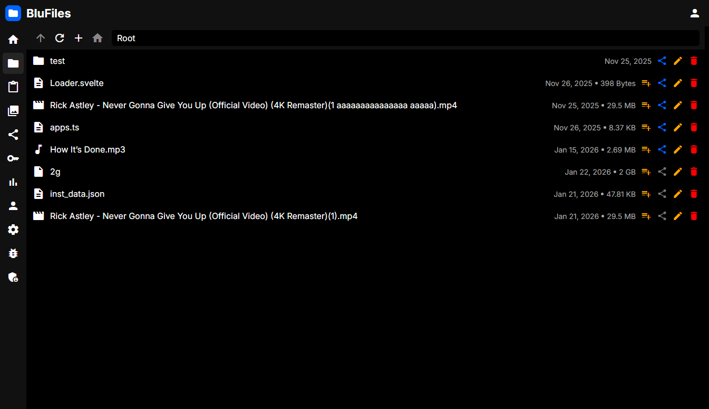
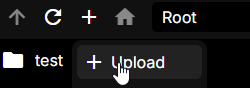
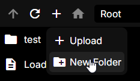
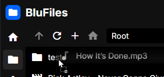

# Files

Using the file manager, you can easily upload, move, rename and delete your files. You can also organize your files into folders.

## Interface

Here you can see an example of the file manager interface:

The file manager consists of a toolbar at the top, and the content display at the bottom.

### Toolbar

The toolbar contains the following items from left to right:

1. **Up**: Move up one directory level
2. **Refresh**: Reloads the current directory
3. **New**: Choose to upload a file or create a new folder
4. **Home**: Move to the root directory
5. **Address Bar**: Displays the current directory

#### Search and Sort

On the right side of the toolbar, you can find the search and sort options:

**Search**: Here you can search for files and folders by name. The button to the right of the search input allows you to toggle between searching for files in the current directory, recursively in the current directory, or all files on your account.

**Sort**: Here you can choose how files and folders should be sorted. You can toggle between sorting by name, date and size, and choose the direction to sort in.

## Uploading Files

To upload a file, click the "+" icon in the top left of the file manager. Here you can choose to upload a file, and you will be prompted with a file picker. Choose a file, give it a proper name and click "Upload". It will be uploaded to the folder you are currently in.

The file manager also supports drag and drop, so you can simply drag a file from your computer into the file manager to upload it.

## Sharing Files and Folders

See [Sharing Items](../../features/sharing/index.md#sharing-items) for more information.

## Creating Folders

To create a folder, click the "+" icon in the top left of the file manager, and choose "New Folder". You will be prompted to enter a name for the folder. Once you have entered a name, click "Create" and the folder will be created in the current directory.

## Moving Files

To move a file, simply click and drag it to the desired location. You can move files into folders, or to move it into the root directory, you can drag it to the "Home" icon in the top left of the file manager.

## Renaming Files

To rename a file, click on the edit button on the right of the file you want to rename. You will be prompted to enter a new name for the file. Once you have entered a new name, click "Rename" and the file will be renamed.
