# Sharing

In the "Sharing" section, you will see an overview of your shared files, folders, pastes and collections. From here, you can also copy or remove links to your shared items.

## Interface

The main interface shows a list of your shared items:

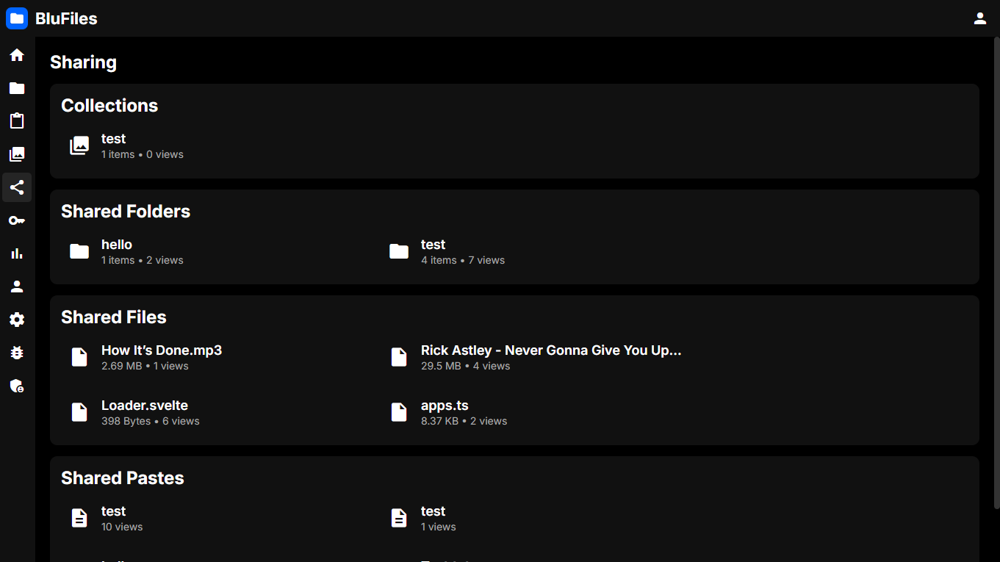

## Sharing Items

To share something, find the "Share" icon on a file, folder, paste or collection and click it. Here you can choose to create and copy a link, or delete an existing shared link. You also have the option to protect shared items using a password, which is explained further below

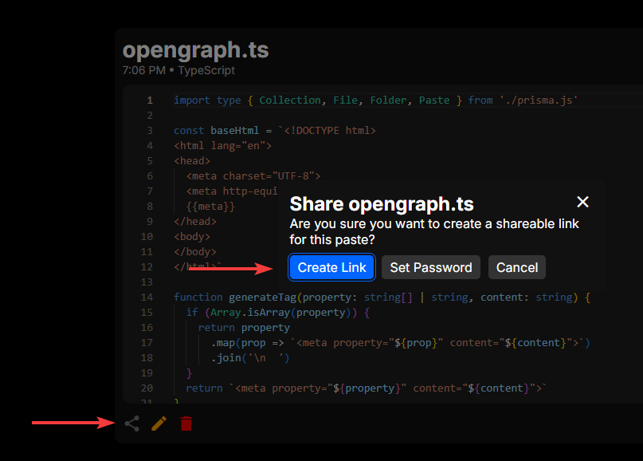

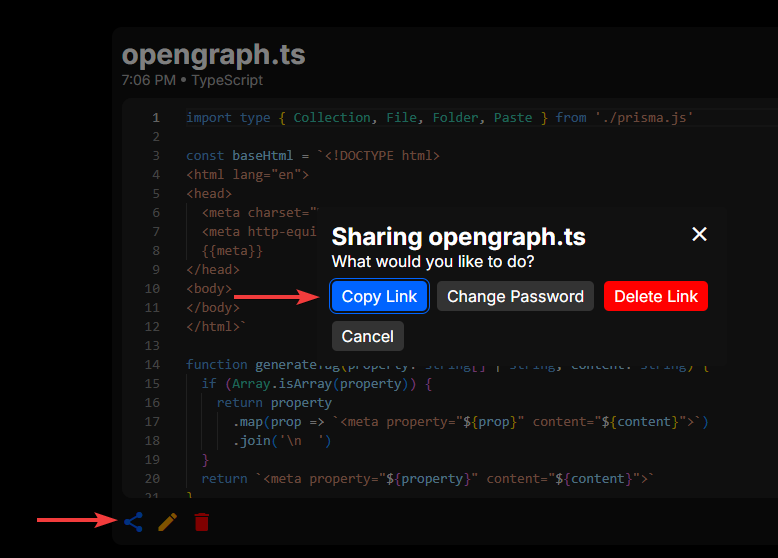

## Protecting Shared Items

When creating a share, you have the option to set a password that a viewer is required to enter to view the contents. You can also set this on an existing share.

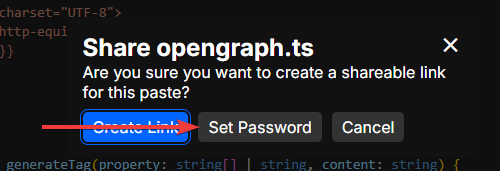

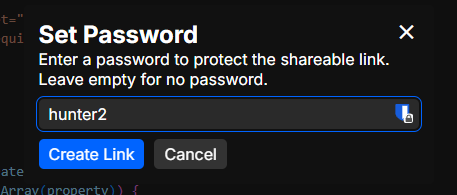

You are also able to remove the password by clicking "Change Password -> "Remove Password":

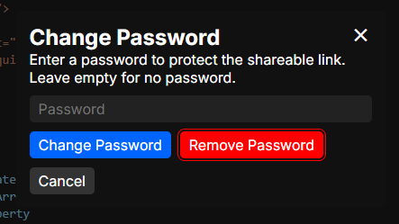

The password is securely hashed and verified using bcrypt2, and no information about the share is exposed to the API without providing the correct password.

## Viewing Shared Items

Shared items can be viewed by anyone with the correct link. The shared item page shows the content of the file, folder, paste or collection, along with information about the item and the person who shared it. Files will have options to be downloaded.

### Protected Items

When you open a link to a shared item that is protected with a password, you will be met with the following screen:

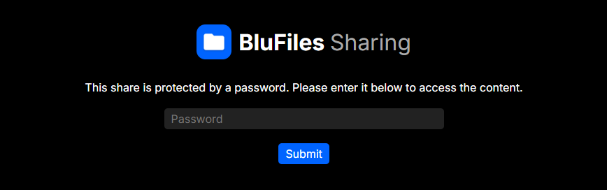

Here you must enter the correct password to be able to retrieve the content of the share. After the correct password is entered, the content can be viewed and downloaded as normal.

### Viewing Files

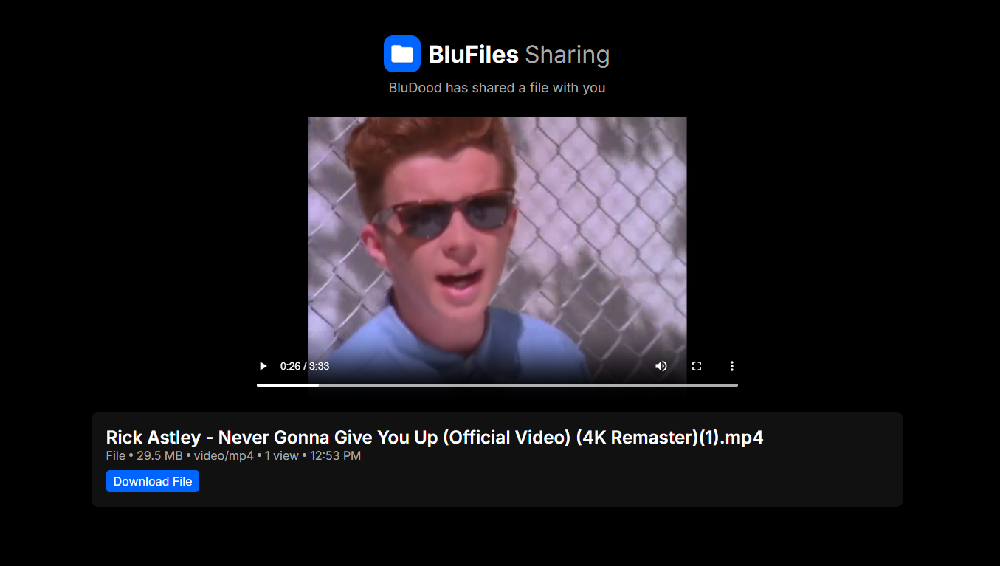

When viewing a shared file, you can see the file's content and metadata. You can also download the file directly from this page.

> [!TIP]
> Supported file types will be rendered directly in the browser. This includes images, videos, audio files and plain text files. If the file type is unknown/unsupported, the preview will be hidden.

### Viewing Folders

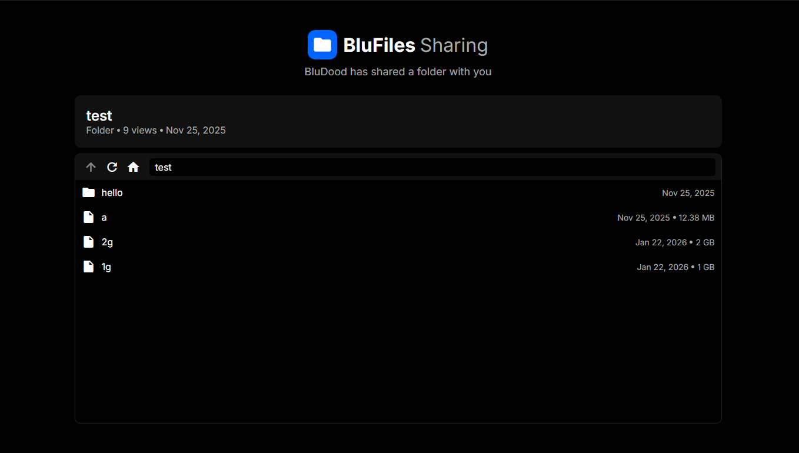

When viewing a shared folder, you can see the list of files and subfolders, similar to the file manager interface. You can also click on a file to view or download it.

### Viewing Pastes

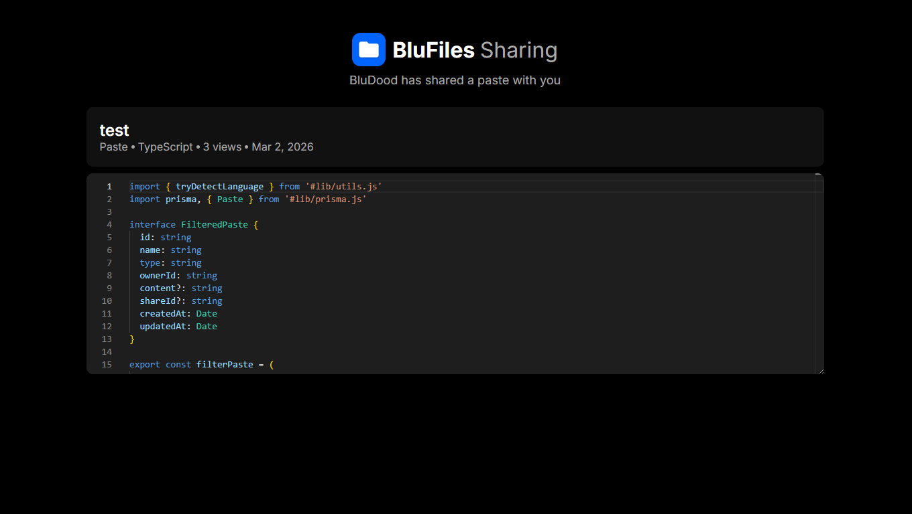

When viewing a shared paste, you can see the content and some metadata. This uses the same code editor as the paste editor, which makes it easy to highlight and copy code.

## Removing Shared Links

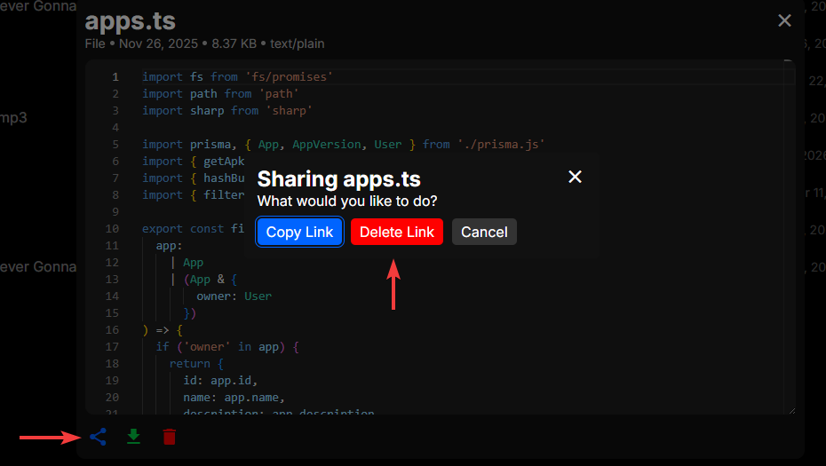

Shared links can be removed from the sharing interface. Just click the share icon and choose "Delete Link" to remove the shared link.
