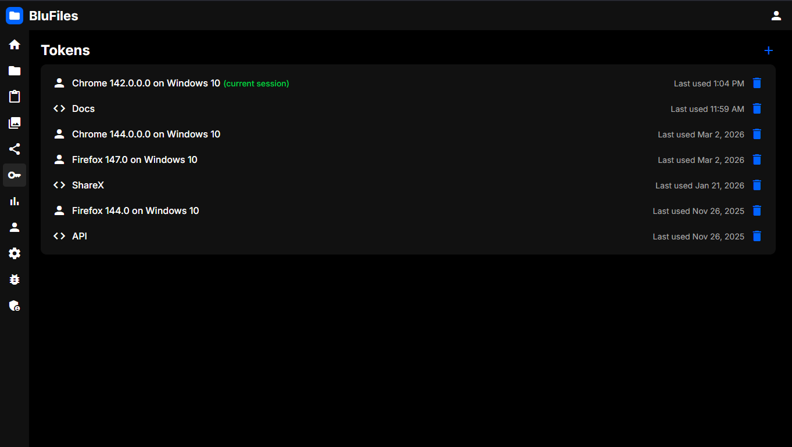
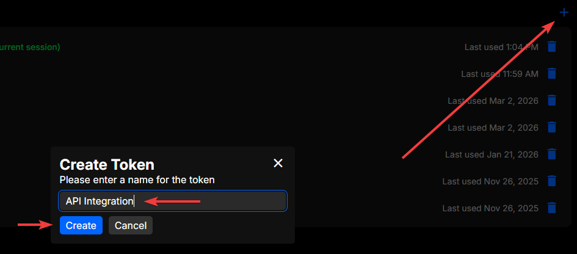
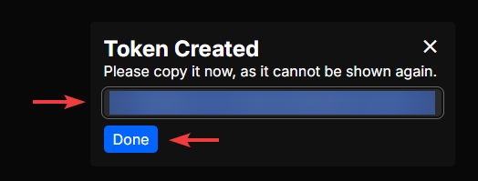
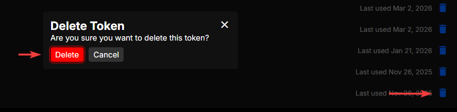
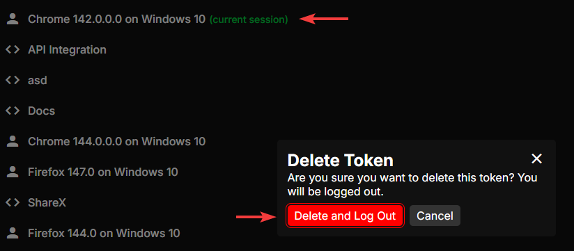

# Tokens

In the "Tokens" section, you can administrate your logged in devices as well as API tokens. API (uploader) tokens can be generated for use in scripts to upload files, create pastes, etc. This is explained further in the [User Guide](./).

## Interface

The main interface shows a list of your tokens:

API tokens will have the `<>` symbol next to them. Your current session token will have the "current session" label next to it. You can also see when a token was last used.

## Generating API Tokens

To generate an API token, click the "+" icon in the top right of the page. You will be prompted to enter a name for the token, and then click "Create". The token will be generated and displayed to you. Make sure to copy the token and store it somewhere safe, as you won't be able to see it again.

## Deleting Tokens

To delete a token, click the trash icon on the right side of the token you want to delete. You will be prompted to confirm the deletion, and once you confirm, the token will be deleted and can no longer be used.

If you delete the token for your current session, you will be logged out.
