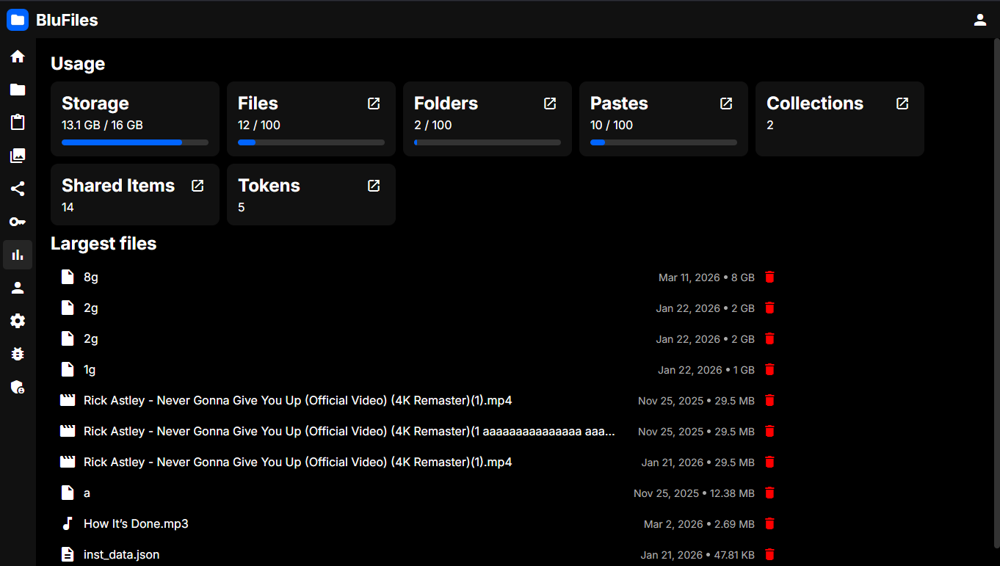

# Usage

In the "Usage" section, you will see an overview of your own usage of storage, amount of files, pastes, etc. You will also see your max limits if the admin has set any.

You will also see a list of your largest files and their sizes, so you can easily identify and delete large files to free up your quota.

